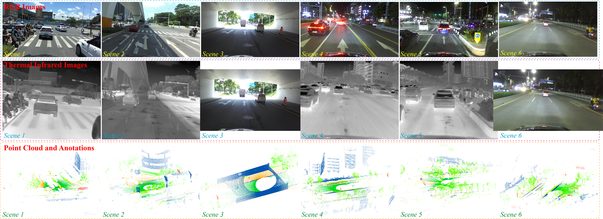

# RTPSeg
RTPSeg: A Multi-Modality Dataset for LiDAR Point Cloud Semantic Segmentation Assisted with RGB-Thermal Images In Autonomous Driving, ISPRS J. P&RS 2026.

# Abstracts
LiDAR point cloud semantic segmentation is crucial for scene understanding in autonomous driving, yet the sparse and textureless characteristics of point clouds cause huge challenges for this task. To address this, numerous studies have explored to leverage the dense color and fine-grained texture from RGB images for multi-modality 3D semantic segmentation. Nevertheless, these methods still encounter certain limitations when facing complex scenarios, as RGB images degrade under poor lighting conditions. In contrast, thermal infrared (TIR) images can provide thermal radiation information of road objects and are robust to illumination change, offering complementary advantages to RGB images. Therefore, in this work we introduce RTPSeg, the first and only multi-modality dataset to simultaneously provide RGB and TIR images for point cloud semantic segmentation. RTPSeg includes over 3000 synchronized frames collected by RGB camera, infrared camera, and LiDAR, providing over 248M pointwise annotations for 18 semantic categories in autonomous driving, involving urban and village scenes during both daytime and nighttime. Based on RTPSeg, we also propose RTPSegNet, a baseline model for point cloud semantic segmentation jointly assisted with RGB and TIR images. Extensive experiments demonstrate that the RTPSeg dataset presents considerable challenges and opportunities to existing point cloud semantic segmentation approaches, and our RTPSegNet exhibits promising effectiveness in jointly leveraging the complementary information between point clouds, RGB images, and TIR images. More importantly, the experimental results also confirm that 3D semantic segmentation can be effectively enhanced by introducing additional TIR image modality, revealing the promising potential of this innovative research and application. We anticipate that the RTPSeg will catalyze in-depth research in this field. 

# Highlights
To bridge the research gap and promote in-depth research, we introduce RTPSeg, the first and only dataset comprising RGB and TIR images for 3D semantic segmentation in autonomous driving. RTPSeg fills the void of a specialized dataset and establishes itself as a novel benchmark, presenting considerable challenges and opportunities to existing approaches. More importantly, as a pioneering effort, the introduction of RTPSeg effectively validates the effectiveness of TIR images for 3D semantic segmentation, which has not been publicly validated before as far as we know. We hope that RTPSeg will spur in-depth exploration in this field.

To validate RTPSeg, we also propose RTPSegNet, a baseline model for 3D semantic segmentation assisted with RGB-thermal images, achieving the SOTA performance on RTPSeg and exhibiting promising effectiveness in jointly leveraging the complementary information between point clouds, RGB images, and TIR images.  Compared with previous multi-modality methods, RTPSegNet can solve the challenge of RGB images degeneration under backlighting or low-light conditions by integrating the thermal radiation information of TIR images into model training. 

# Demo
| Name | Vedio Demo |
|------|------|
| LiDAR_GT |  |
| RGB Images |  |
| TIR Images|  |
| RGB Images with Projected Points |  |
| TIR Images with Projected Points |  |

# Dataset

File shared via Baidu Netdisk: RTPSeg.zip
Link: https://pan.baidu.com/s/1S4HAkJLpNafakcaNLI9UJA
key: kb24
One Drive Link: https://drive.google.com/file/d/1F0SVT87ynoa_3JaOE602tBzMojjLVPWR/view?usp=sharing

├── RTPSeg/datasets/

│   ├── 01

│   ├── 02

│   ├── ...

│   ├── 102

│   └── 103

# Inference
We provide the pretrained model of ResNet and RTPSegNet for inference:

File shared via Baidu Netdisk: model
Link: https://pan.baidu.com/s/1fSFwQJUY7YDkVshANxMcaw
Access code: kb24

Note that we only provide the best version of RTPSegNet jointly trained with RGB and thermal infrared images, corresponding to the highest performance in our paper. You can choose to retrain the model to get other versions of RTPSegNet.

# Environment
You can refer to the requirements.txt to construct the experimental environment, or pip install -r requirements.txt.
We confirm that our project can be conducted on Python 3.8, CUDA 11.X or 12.X.

# Citation
If you find our work useful in your research, please consider citing it:

@article{SUN202625,

author = {Yifan Sun and Chenguang Dai and Wenke Li and Xinpu Liu and Yongqi Sun and Ye Zhang and Weijun Guan and Yongsheng Zhang and Yulan Guo and Hanyun Wang},

title = {RTPSeg: A multi-modality dataset for LiDAR point cloud semantic segmentation assisted with RGB-thermal images in autonomous driving},

journal = {ISPRS Journal of Photogrammetry and Remote Sensing},

volume = {233},

pages = {25-38},

year = {2026},

issn = {0924-2716},

doi = {https://doi.org/10.1016/j.isprsjprs.2026.01.008},

url = {https://www.sciencedirect.com/science/article/pii/S0924271626000080},

keywords = {Dataset, Point cloud semantic segmentation, RGB image, Thermal infrared image, Autonomous driving},

}

# Acknowledgement
Thanks the following work, which give us much inspiration:

@inproceedings{yan20222dpass,

  title={2dpass: 2d priors assisted semantic segmentation on lidar point clouds},
  
  author={Yan, Xu and Gao, Jiantao and Zheng, Chaoda and Zheng, Chao and Zhang, Ruimao and Cui, Shuguang and Li, Zhen},
  
  booktitle={European Conference on Computer Vision},
  
  pages={677--695},
  
  year={2022},
  
  organization={Springer}
}

# Feedback
For any questions or feedback, please feel free to contact the author, who will make every effort to assist in order to ensure that this work truly serves community research.
